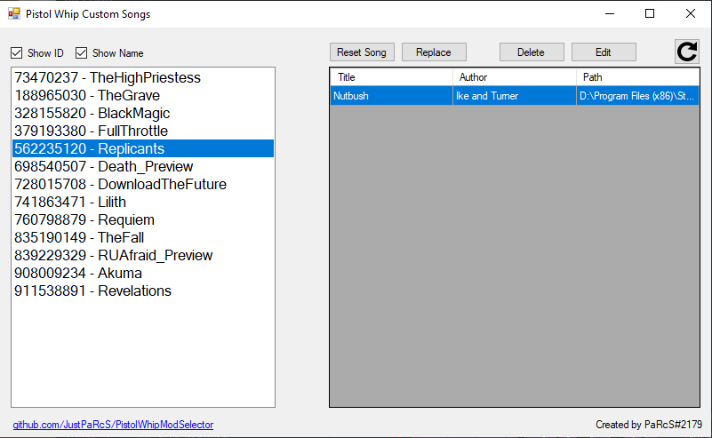
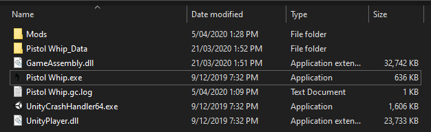
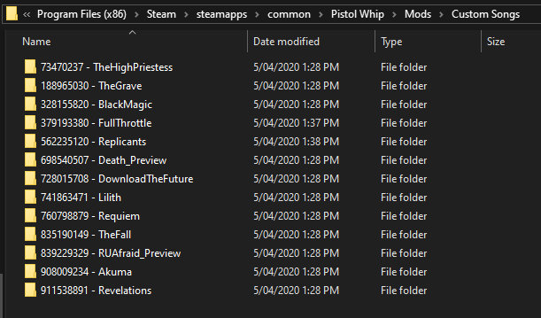
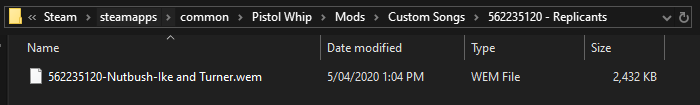

# Pistol Whip Custom Songs
A simple song manager for Pistol Whip VR game.



**Notes:**
* This is for windows only, Oculus Quest or mac variants are not supported by this app.
* The below guide is based around the steam build of Pistol Whip
* Songs must be in wem format to be used with this tool.
* If you need any assistance or support, message **PaRcS#2179** on discord.

**Warning:**  
Before continuing, make sure to revert any custom songs you may have installed, this tool will backup the stock songs when it launches for the first time, preferably you would want the original game songs to be backed up and not your own.


## Usage?

1. Download the exe from the "Download EXE here" directory of this repo and save it anywhere on disk i.e. Desktop
2. Run the tool as Administrator (Right click exe and select "Run as Administrator"), the tool will writing to your game install directory, the tool must have rights to do so, typically program files and subdirectories are protected, you can also modify permissions on the game directory if preferred
3. You'll be asked to select your Pistol Whip game exe, i.e. ```C:\Program Files\Steam\steamapps\common\Pistol Whip\Pistol Whip.exe```, if installed via steam it may have already been auto detected.
4. Assuming you ran the tool with Administrator and it could write to your game directory you will find a new folder inside the Pistol Whip root directory called Mods



This directory will contain another 2 folders, Custom Songs and Original.

* "Original" will contain the song backups
* "Custom Songs" is where we will put our custom .wem files

5. Navigate to the custom songs folder



6. You will notice folders representing the stock songs as an example we will open the "562235120 - Replicants" folder
7. Copy a custom and compatible wem file into this folder
8. Finally rename the newly added file in the following format

```<SONG_CODE>-<TITLE>-<AUTHOR>.wem```

i.e.



If you did this correctly you can return to the PistolWhipCustomSongs1.0 app, select Replicants from the left hand pane and press refresh to see your custom song.


## UI Elements
### Replace
Will replace the current song with the selected custom song.

### Reset Song
Will revert the selected song back to the original unmodified version.

### Delete /
Simply deletes the selected custom song

## Edit
Provides a ui to edit attributes about the song i.e. author title
